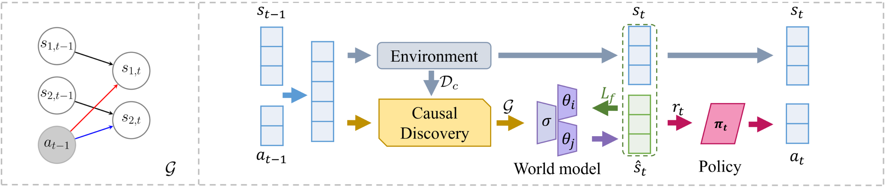

## News
Caught up in the whirlwind of NeurIPS'24 — this repo might have to wait a bit for its turn in the spotlight!

# CausalExploration
This is the official implementation of the paper "Boosting Efficiency in Task-Agnostic Exploration Through Causal Knowledge", which was accepted for IJCAI-2024. 

## Introduction
The effectiveness of model training heavily relies on the quality of available training resources. However, budget constraints often impose limitations on data collection efforts. To tackle this challenge, we introduce *causal exploration* in this paper, a strategy that leverages the underlying causal knowledge for both data collection and model training. We, in particular, focus on enhancing the sample efficiency and reliability of the world model learning within the domain of task-agnostic reinforcement learning. During the exploration phase, the agent actively selects actions expected to yield causal insights most beneficial for world model training. Concurrently, the causal knowledge is acquired and incrementally refined with the ongoing collection of data. We demonstrate that causal exploration aids in learning accurate world models using fewer data and provide theoretical guarantees for its convergence. Empirical experiments, on both synthetic data and real-world applications, further validate the benefits of causal exploration.

Our key contributions are summarized as:
- In order to enhance the sample efficiency and reliability of model training with causal knowledge, we introduce a novel concept: causal exploration, and focus particularly on the domain of task-agnostic reinforcement learning.
- To efficiently learn and use causal structural constraints, we develop an online method for causal discovery and formulate the world model with explicit structural embeddings. During exploration, we train the dynamics model under a novel weight-sharing-decomposition schema that can avoid additional computational burden.
- Theoretically, we show that, given strong convexity and smoothness assumptions, our approach attains a superior convergence rate compared to non-causal methods. Empirical experiments further demonstrate the robustness of our online causal discovery method and validate the effectiveness of causal exploration across a range of demanding reinforcement learning environments.

## Method Overview
Throughout the process, the agent, guided by policy $\pi_t$, engages in exploration to gather data that are most beneficial for model training. Meanwhile, causal knowledge and the world model are continuously refined with the ongoing data collection.

## Theoretical Analysis
**Assumption 1.** $L_f$ is strongly convex and smooth such that $\exists ~m>0,~M>0$, for any $\boldsymbol{w} \in \text{dom }L_f$, we have: $$MI \succeq \nabla^2 L_f(\boldsymbol{w}) \succeq mI.$$

The following theorem shows a reduced error bound with causal exploration.

**Theorem 1**  
Suppose **Assumption 1** holds, and suppose the density of the causal matrix $D$ is $\delta$ and the model is initialized with $\boldsymbol{w}_{0}$. Then for every optimization step $k$, we have: $$L_f(\boldsymbol{w}^c(k)) - L_f^\star \le \delta^k \left( L_f(\boldsymbol{w}(k)) - L_f^\star\right) \le \frac M2 \left[ \delta  \left( 1- \frac m M \right)\right]^k \| \boldsymbol{w}_{0} - \boldsymbol{w}^\star \|^2_2.$$

The first inequality establishes an upper bound for $\xi$ at $ \delta^k $. Given that $0 \le \delta^k \le 1$, this confirms the effectiveness of causal exploration in enhancing efficiency. The subsequent inequality establishes that the training error of causal exploration gradually converges to the optimal value, exhibiting an \textit{exponential} convergence rate characterized by the decay of the factor $\left[ \delta  \left( 1- \frac m M \right)\right]^k$. Moreover, this theorem implies that the advantages of causal exploration are relevant to the sparseness of causal structure. The sparser the causal structure, the faster our method learns. When the causal matrix $D$ is a complete matrix ($\delta = 1$), causal exploration degenerates into non-causal prediction-based exploration. The proof for Theorem 1 is provided in Appendix.

